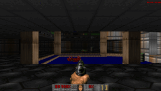
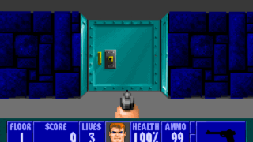
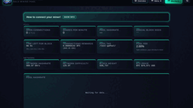
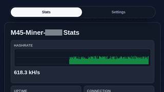
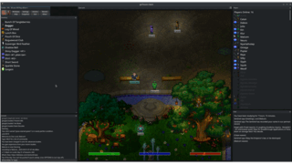
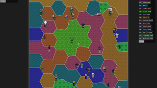
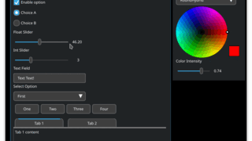
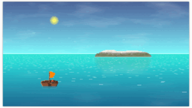
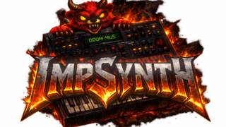

  

  

## About Me

I work across software, electronics, and data, with a focus on systems programming, game development, automation, and infrastructure-oriented tooling. My projects often combine implementation with measurement, using benchmarks, visualizations, and prototypes to make trade-offs explicit.  

I approach projects iteratively: build, measure, refine, and document. Some repositories are production-ready tools, while others are focused experiments used to validate a design or architectural approach.  

I value efficiency and leverage through automation, clear interfaces, and practical tooling that reduces friction between an idea and a working system.  

In practice, that means building systems, observing how they behave, and refining them until they are reliable, understandable, and useful.

## Project Snapshots
Small thumbnails from projects where visuals help show the work at a glance.

<table>
  <tr>
    <td align="center" width="20%">
      <a href="https://github.com/Distortions81/GD-DOOM">
         
        GD-DOOM
      </a>
    </td>
    <td align="center" width="20%">
      <a href="https://github.com/Distortions81/GD-WOLF">
         
        GD-WOLF
      </a>
    </td>
    <td align="center" width="20%">
      <a href="https://github.com/Distortions81/M45-goPool">
         
        M45-goPool
      </a>
    </td>
    <td align="center" width="20%">
      <a href="https://github.com/Distortions81/M45-Core-Firmware">
         
        M45-Core-Firmware
      </a>
    </td>
    <td align="center" width="20%">
      <a href="https://github.com/Distortions81/goThoom">
         
        goThoom
      </a>
    </td>
  </tr>
  <tr>
    <td align="center" width="20%">
      <a href="https://github.com/M45-Science/ChatWire">
         
        ChatWire
      </a>
    </td>
    <td align="center" width="20%">
      <a href="https://github.com/Distortions81/ONI-SeedView">
         
        ONI-SeedView
      </a>
    </td>
    <td align="center" width="20%">
      <a href="https://github.com/Distortions81/EUI">
         
        EUI
      </a>
    </td>
    <td align="center" width="20%">
      <a href="https://github.com/Distortions81/PixelPirates">
         
        PixelPirates
      </a>
    </td>
    <td align="center" width="20%">
      <a href="https://github.com/Distortions81/ImpSynth">
         
        ImpSynth
      </a>
    </td>
  </tr>
</table>

## Featured Projects
A short public shortlist for the work I would point people to first. Private and smaller projects are represented in the project map below.

| Project | Focus | Why it is featured |
| --- | --- | --- |
| [GD-DOOM](https://github.com/Distortions81/GD-DOOM) | Go game engine / WebAssembly | A full Doom engine with faithful and enhanced render modes, WAD loading, saves, demos, MIDI backends, native builds, and browser play. [Play](https://m45sci.xyz/u/dist/GD-DOOM/) |
| [TangMiner](https://github.com/Distortions81/TangMiner) | FPGA Bitcoin hardware | Tang Nano FPGA hash engine in SpinalHDL/Scala, paired with a host Stratum client and strict real-hardware nonce validation. |
| [M45-goPool](https://github.com/Distortions81/M45-goPool) | Bitcoin infrastructure | Standalone Go mining pool with Bitcoin Core RPC/ZMQ integration, Stratum serving, TLS, status UI/API, and operational hardening. [Pool](https://m45core.com/) |
| [M45-Gamma-Firmware](https://github.com/Distortions81/M45-Gamma-Firmware) | Embedded miner firmware | Bitaxe Gamma 602 firmware with Web Serial flashing, OTA packaging, dashboard, pool failover, safety limits, and hardware diagnostics. [Flasher](https://distortions81.github.io/M45-Gamma-Firmware/) |
| [GD-WOLF](https://github.com/Distortions81/GD-WOLF) | Go game engine / WebAssembly | Wolfenstein 3D-style engine with software raycasting, save previews, browser persistence, spatial audio, and selectable render modes. [Play](https://m45sci.xyz/u/dist/GD-WOLF/) |
| [goThoom](https://github.com/Distortions81/goThoom) | Desktop game client | Modern Clan Lord client built on Ebiten with cross-platform rendering, plugins, text-to-speech, asset fetching, and legacy graphics cleanup. |
| [ChatWire](https://github.com/M45-Science/ChatWire) | Game server operations | Long-running Discord-to-Factorio bridge with moderation workflows, server orchestration, HTTP APIs, WebSockets, and live diagnostics. [Community](https://m45sci.xyz/) |
| [EUI](https://github.com/Distortions81/EUI) | UI toolkit | Retained-mode Ebiten UI library with windows, widgets, themes, scaling, debug overlays, touch support, and a browser demo. [Demo](https://m45sci.xyz/u/dist/eui/) |

## Curated Project Map
Repository metadata was checked with GitHub CLI on July 12, 2026 across `Distortions81` and `M45-Science`. Public repositories are linked. Private repositories are intentionally named without links.

The ranked list favors visible engineering depth, hardware validation, operational use, and cross-domain integration over recency alone. Smaller utilities, mirrors, and lightly modified forks are grouped lower or omitted from the main ranking.

### Best First
| Rank | Project | Visibility | Area | Why it stands out |
| ---: | --- | --- | --- | --- |
| 1 | [GD-DOOM](https://github.com/Distortions81/GD-DOOM) | Public | Game engine / WebAssembly | Full Doom engine work in Go with faithful and enhanced presentation modes, WAD loading, save/load, demo support, native builds, and browser play. |
| 2 | Encore-4A | Private | FPGA / retrocomputing | Passive TI-99/4A side-port snooper for Tang Nano 20K that reconstructs VDP/PSG state, outputs HDMI video and audio, and supports emulator-fed replay. |
| 3 | FocusTerm | Private | FPGA / embedded terminal | Tang Nano 20K hardware terminal with a shared 80x24 display pipeline, multi-video FPGA target, and optional ESP32 SSH/SPI companion firmware. |
| 4 | [TangMiner](https://github.com/Distortions81/TangMiner) | Public | FPGA / Bitcoin hardware | SpinalHDL/Scala Bitcoin hash engine for Sipeed Tang Nano boards, paired with a host Stratum client and strict hardware nonce validation. |
| 5 | [M45-goPool](https://github.com/Distortions81/M45-goPool) | Public | Bitcoin infrastructure | Standalone mining pool with Bitcoin Core RPC/ZMQ integration, Stratum serving, TLS, status UI/API, rate limiting, bans, and operations docs. [Pool](https://m45core.com/) |
| 6 | [M45-Gamma-Firmware](https://github.com/Distortions81/M45-Gamma-Firmware) | Public | Embedded firmware | Bitaxe Gamma 602 firmware with Web Serial flashing, OTA packaging, live dashboard, PMBus/fan/OLED integration, and safety controls. |
| 7 | [M45-Core-Firmware](https://github.com/Distortions81/M45-Core-Firmware) | Public | Embedded firmware | ESP32-WROOM-32 mining controller firmware combining Stratum, hardware SHA candidate loops, display UI, local setup, stats, and settings pages. |
| 8 | TMX9999-FPGA | Private | FPGA / CPU design | TMS9900-compatible soft CPU and SoC work with HDMI text/graphics output, UART monitor, flash-loaded firmware, and compiled BASIC bring-up. |
| 9 | LM32-FPGA | Private | FPGA / CPU design | Direct LM32 integer soft CPU SoC with initialized RAM, UART, LED I/O, HDMI console/graphics modes, flash filesystem access, and benchmark tooling. |
| 10 | [GD-WOLF](https://github.com/Distortions81/GD-WOLF) | Public | Game engine / WebAssembly | Wolfenstein 3D-style engine in Go with software raycasting, save previews, browser persistence, native builds, and selectable render modes. [Play](https://m45sci.xyz/u/dist/GD-WOLF/) |
| 11 | [goThoom](https://github.com/Distortions81/goThoom) | Public | Desktop client | Modern Clan Lord client with Ebiten render backends, runtime plugin support, asset handling, text-to-speech, and legacy-graphics cleanup. |
| 12 | [ChatWire](https://github.com/M45-Science/ChatWire) | Public | Game server operations | Long-running Discord-to-Factorio bridge with moderation, server orchestration, HTTP APIs, WebSockets, live logging, and production use since 2017. [Community](https://m45sci.xyz/) |
| 13 | FactMapGen | Private | Factorio tooling | Browser editor for Factorio map generation/settings files with authentication, auditing, preset management, and queued headless Factorio preview rendering. [Editor](https://mapgen.m45sci.xyz/) [M45-Science](https://m45sci.xyz/) |
| 14 | Facility38 | Private | Simulation | Massively parallel game simulation proof-of-concept focused on scale, resource flows, and systems behavior. |
| 15 | [ONI-SeedView](https://github.com/Distortions81/ONI-SeedView) | Public | Visualization / WebAssembly | Interactive Oxygen Not Included seed viewer using Go/Ebiten, map overlays, export support, and mobile-friendly controls. |
| 16 | [EUI](https://github.com/Distortions81/EUI) | Public | UI toolkit | Retained-mode Ebiten UI library with windows, flows, widgets, themes, scaling, debug overlays, and touch support. |
| 17 | [GoMUD2](https://github.com/Distortions81/GoMUD2) | Public | Server runtime | Go MUD server with telnet, optional TLS, ANSI rendering, in-game OLC editing, and structured player/builder/admin roles. |
| 18 | ProtonSync | Private | Linux automation | Upload-first Proton Drive sync helper with inotify watching, stability checks, hashed state, terminal UI, and explicit safety modes. |

### Public Work By Area
| Area | Repositories |
| --- | --- |
| Hardware, firmware, and infrastructure | [TangMiner](https://github.com/Distortions81/TangMiner), [M45-goPool](https://github.com/Distortions81/M45-goPool) ([Pool](https://m45core.com/)), [M45-Gamma-Firmware](https://github.com/Distortions81/M45-Gamma-Firmware), [M45-Core-Firmware](https://github.com/Distortions81/M45-Core-Firmware), [DaVinci-Resolve-Container](https://github.com/Distortions81/DaVinci-Resolve-Container), [Canon-Webcam-Linux](https://github.com/Distortions81/Canon-Webcam-Linux), [PCB-Frame](https://github.com/Distortions81/PCB-Frame), [IrPowerOn](https://github.com/Distortions81/IrPowerOn) |
| Engines, clients, and interactive tools | [GD-DOOM](https://github.com/Distortions81/GD-DOOM), [GD-WOLF](https://github.com/Distortions81/GD-WOLF), [goThoom](https://github.com/Distortions81/goThoom), [ONI-SeedView](https://github.com/Distortions81/ONI-SeedView), [PixelPirates](https://github.com/Distortions81/PixelPirates), [GoMUD2](https://github.com/Distortions81/GoMUD2), [goMMO](https://github.com/Distortions81/goMMO) / [goMMOServ](https://github.com/Distortions81/goMMOServ), [goMarketMadness](https://github.com/Distortions81/goMarketMadness) / [Market-Madness-TI99](https://github.com/Distortions81/Market-Madness-TI99) |
| Libraries, audio, and data experiments | [EUI](https://github.com/Distortions81/EUI), [ImpSynth](https://github.com/Distortions81/ImpSynth), [GoBeep86](https://github.com/Distortions81/GoBeep86), [go-g726](https://github.com/Distortions81/go-g726), [numfmt](https://github.com/Distortions81/numfmt), [goXA](https://github.com/Distortions81/goXA), [Acoustic-Space-Rendering](https://github.com/Distortions81/Acoustic-Space-Rendering), [OpenCLFrac](https://github.com/Distortions81/OpenCLFrac) / [golang-frac](https://github.com/Distortions81/golang-frac), [GoRecoverBlurText](https://github.com/Distortions81/GoRecoverBlurText) |
| [M45-Science operations](https://m45sci.xyz/) | [ChatWire](https://github.com/M45-Science/ChatWire), [SoftMod](https://github.com/M45-Science/SoftMod), [FactorioServerBrowser](https://github.com/M45-Science/FactorioServerBrowser), [DownloadProxy](https://github.com/M45-Science/DownloadProxy), [FactBanSync](https://github.com/M45-Science/FactBanSync), [FactorioCommunityList](https://github.com/M45-Science/FactorioCommunityList), [RelayClient](https://github.com/M45-Science/RelayClient) / [RelayUpdater](https://github.com/M45-Science/RelayUpdater), [RoleBot](https://github.com/M45-Science/RoleBot) / [HelpBot](https://github.com/M45-Science/HelpBot) |
| Smaller utilities and preservation | [SolarLightCalc](https://github.com/Distortions81/SolarLightCalc), [goClanLordImgExport](https://github.com/Distortions81/goClanLordImgExport) / [goClanLordSndExport](https://github.com/Distortions81/goClanLordSndExport), [goPixelChat](https://github.com/Distortions81/goPixelChat), [goRaycast2](https://github.com/Distortions81/goRaycast2), [Collatz](https://github.com/Distortions81/Collatz), [SeqPrimeGo](https://github.com/Distortions81/SeqPrimeGo), [InterferencePattern](https://github.com/Distortions81/InterferencePattern), [goWordSearch](https://github.com/Distortions81/goWordSearch), [goCardinal](https://github.com/Distortions81/goCardinal), [goKillComments](https://github.com/Distortions81/goKillComments) |

### Private Work Represented Without Links
| Area | Repositories | Why they matter |
| --- | --- | --- |
| FPGA and retro hardware | Encore-4A, FocusTerm, TMX9999-FPGA, LM32-FPGA | The strongest private cluster: FPGA video/audio, terminal hardware, soft CPU, and retro system work. |
| Infrastructure and Bitcoin tooling | ProtonSync, PoolCensus, goBitaxeRemote, ScriptSigSearch, stratum-binary-batch, bitgraph | Automation, mining, data inspection, and operational tooling that complements the public Bitcoin/firmware projects. |
| Factorio operations | FactMapGen, FactModDatDecode, relayServer | Internal tooling around map generation, mod data decoding, and server infrastructure. |
| Games and simulations | Facility38, LumenClay, Void-Colony, Shellworld, Network-Sim, TestGame06022026, GamePrototype18 | Larger private experiments in simulation, MUDs, terminal games, and prototype gameplay systems. |
| Data, media, and encoding experiments | QR-Img, GFEC, chatCompress, dm_bias_fit, ottoWave, ottoWave2 | Focused experiments in image/QR handling, forward error correction, compression, audio, and modeling. |
| Local setup and personal tooling | linux-mac-win-setup, Project-List, M45-Swag | Useful supporting repos, but less central to the public portfolio. |

_Thank you for visiting._
